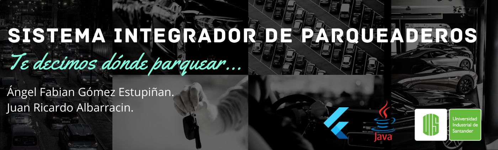

ESPAÑOL:
# Sistema Integrador de Parqueaderos.

Este proyecto fue propesto para la asignatura Ingeniería de Software II (Es la continuación de lo desarrollado en Parking-UIS).

Este proyecto esta compuesto por una app de escritorio para gestion de UN parqueadero y una app movil dar información a los usuarios de las plazas libres en el parqueadero.

El proyecto está desarrollado en el lenguaje de programación Java para la App de escritorio y Flutter para la app movil.

Video explicativo: https://youtu.be/qqpbgQZCTYI

Link a App de escritorio https://drive.google.com/drive/folders/1ihfQiZHrLQvE5F_lfb8mWmpTvEVZIrd_?usp=sharing

ENGLISH:
# Integrating Parking System.

This project was planned for the Software Engineering II course (It is the continuation of what was developed in Parking-UIS).

This project is composed of a desktop app for the management of ONE parking lot and a mobile app to give information to users of the free parking spaces in the parking lot.

The project is developed in the Java programming language for the desktop App and Flutter for the mobile app.

Explanatory video:

Link to desktop App https://drive.google.com/drive/folders/1ihfQiZHrLQvE5F_lfb8mWmpTvEVZIrd_?usp=sharing
